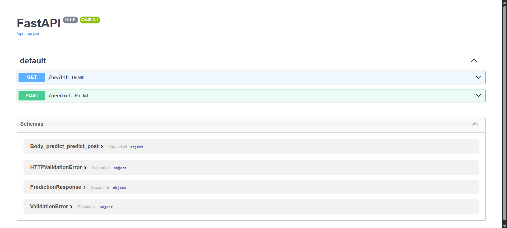
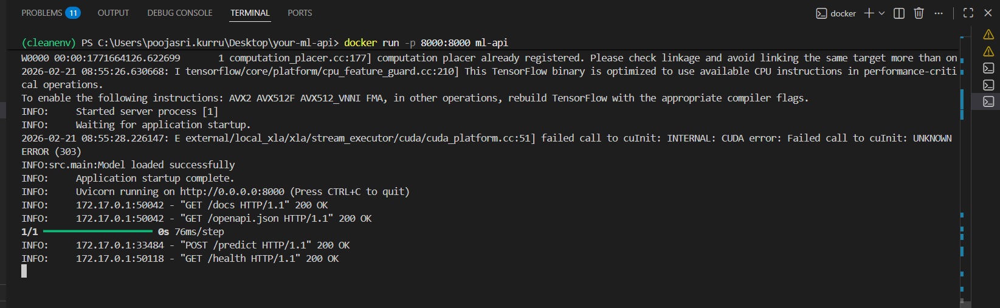
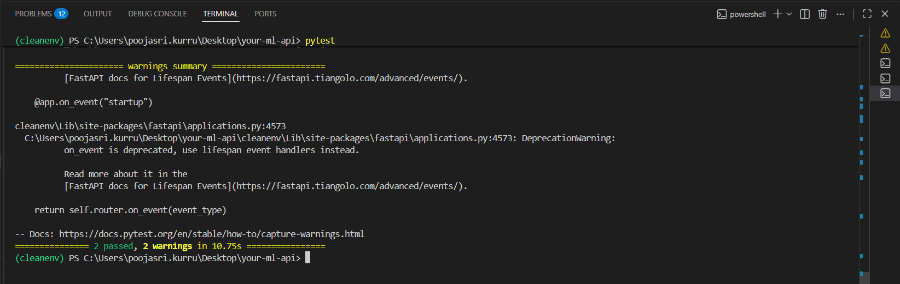

# 🚀 Production-Ready ML Image Classification API (MLOps Project)

## 📌 Project Overview

This project demonstrates how to deploy a trained deep learning image classification model as a production-ready RESTful API using FastAPI, Docker, and GitHub Actions (CI/CD). The primary goal of this project is to bridge the gap between model development and real-world deployment by implementing practical MLOps principles such as containerization, automated testing, CI/CD automation, structured project organization, and environment-based configuration.

The model is a Convolutional Neural Network (CNN) trained on the CIFAR-10 dataset and exposed through a scalable API endpoint for real-time inference.

---

## 🧠 Key Features

- RESTful API built using FastAPI
- Image classification using TensorFlow/Keras
- Model loaded once at application startup (low-latency inference)
- Docker containerization
- Docker Compose support for simplified local setup
- Automated CI/CD pipeline using GitHub Actions
- Unit testing using pytest
- Health check endpoint for monitoring
- Environment variable configuration
- Swagger UI auto-generated documentation
- Clean modular project structure

---

## 🏗️ Technology Stack

- Python 3.11
- FastAPI
- TensorFlow 2.19.1
- NumPy
- Pillow
- Pytest
- Docker
- Docker Compose
- GitHub Actions

---

## 📂 Project Structure

your-ml-api/
│
├── src/
│   ├── main.py
│   ├── model.py
│   └── __init__.py
│
├── models/
│   └── my_classifier_model.keras
│
├── tests/
│   └── test_api.py
│
├── predictions/
│   └── example_prediction.json
│
├── screenshots/
│   ├── swagger_ui.png
│   ├── docker_running.png
│   └── pytest_passed.png
│   ├── health.png
│   └── predict.png
│
├── .github/workflows/
│   └── main.yml
│
├── Dockerfile
├── docker-compose.yml
├── requirements.txt
├── .env.example
└── README.md

---

## ⚙️ Local Development Setup

1. Clone the repository:

   git clone <your_repo_url>
   cd your-ml-api

2. Create virtual environment:

   python -m venv venv
   venv\Scripts\activate

3. Install dependencies:

   pip install -r requirements.txt

4. Run the API locally:

   uvicorn src.main:app --reload

5. Open in browser:

   http://localhost:8000/docs

---

## 🐳 Docker Usage

Build the Docker image:

   docker build -t ml-api .

Run the container:

   docker run -p 8000:8000 ml-api

Access Swagger UI:

   http://localhost:8000/docs

---

## 🐳 Docker Compose (Recommended)

   docker-compose up --build

This builds and runs the application in a single command.

---

## 🔌 API Endpoints

### Health Check

GET /health

Response:
{
  "status": "ok"
}

### Image Prediction

POST /predict

Upload an image file (PNG/JPEG).

Response:
{
  "class_label": "cat",
  "probabilities": [0.01, 0.02, ...]
}

---

## 🧪 Running Tests

Run:

   pytest

Expected output:
   2 passed

Unit tests validate:
- Health endpoint
- Input validation for /predict

---

## 🔄 CI/CD Pipeline (GitHub Actions)

The CI/CD workflow automatically triggers on every push to the main branch.

Pipeline Steps:
1. Checkout repository
2. Set up Python
3. Install dependencies
4. Run unit tests
5. Build Docker image
6. Simulated Docker push
7. Upload prediction artifacts

Workflow status can be monitored in the GitHub "Actions" tab.

---

## 🌍 Environment Variables

.env.example:

MODEL_PATH=models/my_classifier_model.keras
LOG_LEVEL=INFO

This ensures configuration is not hardcoded.

---

## 📸 Proof of Execution

Swagger UI Running:

Docker Container Running Successfully:

Pytest – All Tests Passed:

---

## 📊 Prediction Examples

Sample inference outputs are available inside the predictions/ directory as JSON files.

---

## 🧩 MLOps Best Practices Implemented

- Model loaded once during startup
- Clean separation of API and model logic
- Containerized environment
- Automated CI/CD
- Unit testing
- Environment-based configuration
- Health monitoring endpoint
- Production-ready Docker image
- RESTful API design

---

## 🚀 Future Enhancements

- Add JWT authentication
- Add model monitoring and logging
- Deploy to cloud (AWS/GCP/Azure)
- Implement model versioning
- Add integration tests
- Push Docker image to container registry

---

## 🎯 Conclusion

This project demonstrates a complete end-to-end MLOps workflow:

Model Training → API Development → Containerization → Testing → CI/CD Automation → Production Deployment Ready.

It showcases the ability to convert a trained ML model into a scalable, maintainable, and production-ready inference service.

---

## 👩‍💻 Author

Developed as part of a hands-on MLOps deployment project to demonstrate real-world machine learning engineering skills.